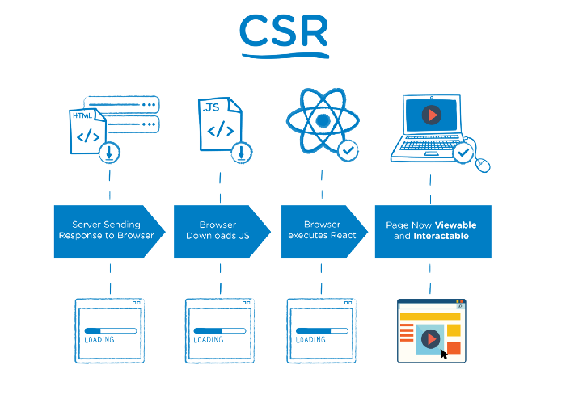
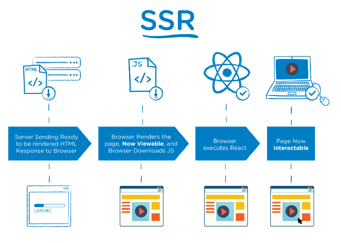

# 1. 초기 Static Sites

- 서버에 배포된 HTML 파일들을 클라이언트의 요청이 있을 때마다 받아와서 보여준다. 작은 요청 (클릭 등)에도 전체적인 문서를 받아와야 하므로 빈 화면(_Blinking Issue_)이 자주 발생하여 UX 측면에서 좋지 못하다.

# 2. SPA (Single Page Application)

- 현대 웹 페이지가 발전하면서 자바스크립트, CSS 및 외부 라이브러리에 대한 의존도가 높아졌다.
- 홈페이지가 최초 로드 될 때 불러올 리소스가 많아짐에 따라 자원을 많이 사용하게 되고, 페이지가 새로고침 할때마다 페이지 전체를 다시 불러와야 하는 비효율성이 대두된다. 그렇기 때문에 자원들을 최초 한 번만 호출해서 필요한 부분만 업데이트하는 방법(CSR)을 적용한 어플리케이션, 즉 SPA가 각광을 받게 된다.

- 사용자들의 기기의 발전 + JS 커뮤니티의 표준화 + SPA의 트렌드로 CSR가 발전하게 된다.

# 3. CSR (Client Side Rendering)

서버에서 먼저 index.html 파일을 보내주는데 이 파일에는 어플리케이션에 필요한 자바스크립트 '링크'만 들어있다. 따라서 처음 접속시 빈 화면만 보이게 되고, 그 후에 필요한 자바스크립트 파일을 다시 받아오는데, 이 파일에는 앱을 구동하는 프레임워크와 라이브러리도 포함되어 있기 때문에 용량이 커서 다운로드에 다소 시간이 걸린다. 이를 기반으로 최종적인 어플리케이션을 보여주게 된다. TTV와 TTI의 간극이 짧은 편이다.

### 🤔 문제점

- 모든 자원들을 최초에 한 번 받기 때문에 초기 구동 속도가 상대적으로 느리다.
- [SEO](https://developer.mozilla.org/ko/docs/Glossary/SEO) (검색엔진 최적화) : CSR에서 사용되고있는 HTML의 body는 대부분 비어있기 때문에, 검색엔진들이 웹 크롤링 하기에 어려움이 있다. 하지만 Next.js, GatsbyJS 등의 라이브러리가 CSR에서도 SEO를 할 수 있도록 지원해준다.

# 4. SSR (Server Side Rendering)

서버로부터 index.html과 이를 동적으로 제어할 수 있는 JS파일도 함께 받아온다.
초기 속도가 빠르고 효율적인 SEO가 가능하다.

### 🤔 문제점

- Static sites와 같이 사용자가 클릭을 하게 되면 전체적인 웹사이트를 서버에서 다시 받아오기 때문에 여전히 Blinking issue가 있다.
- 서버에 과부하가 걸리기 쉽다.
- 사용자가 빠르게 웹사이트를 확인할 수는 있지만 JS파일을 아직 받아오지 못한 경우 반응이 없을 수 있다. 즉, TTV와 TTI간의 공백 기간이 긴 편이다.

# 4. 정리

|   CSR    |         |  SSR   |
| :------: | :-----: | :----: |
|  느리다  | **TTV** | 빠르다 |
| 비효율적 | **SEO** | 효율적 |
|  빠르다  | **TTI** | 느리다 |

---

# 📂 Reference

- https://medium.com/walmartglobaltech/the-benefits-of-server-side-rendering-over-client-side-rendering-5d07ff2cefe8
- https://youtu.be/iZ9csAfU5Os
